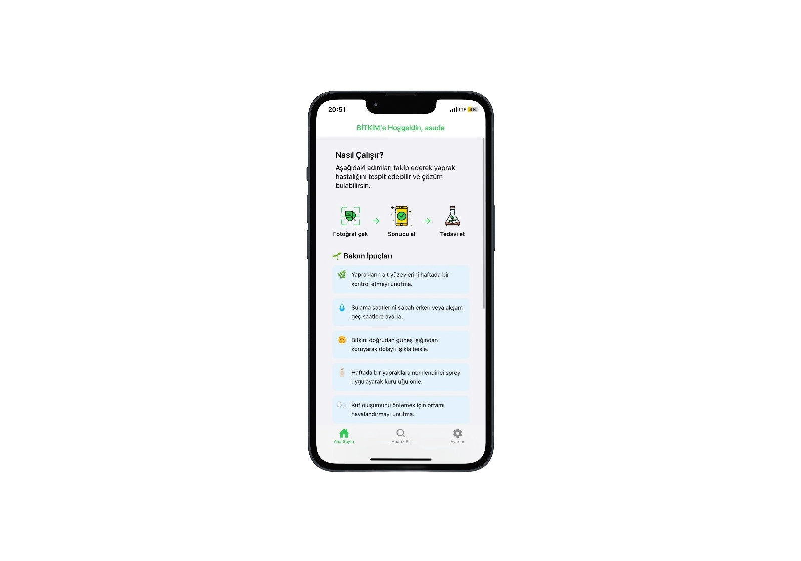
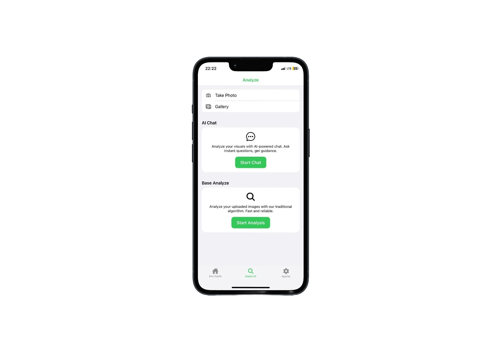
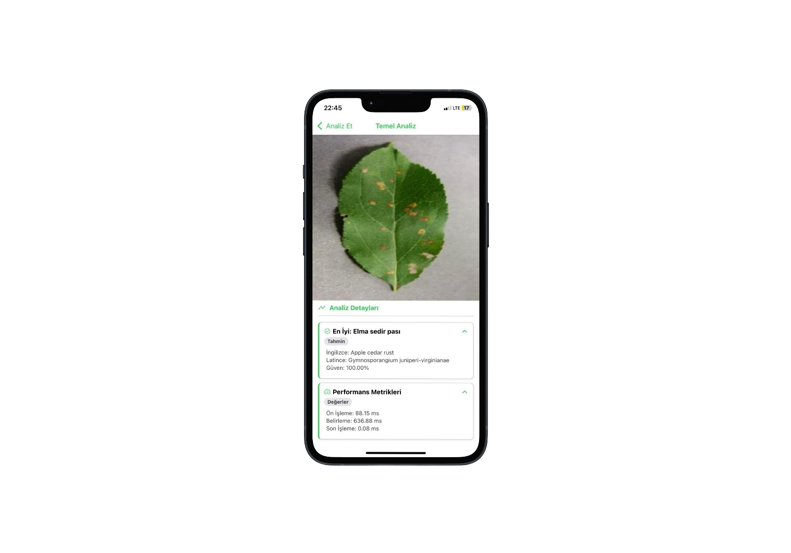
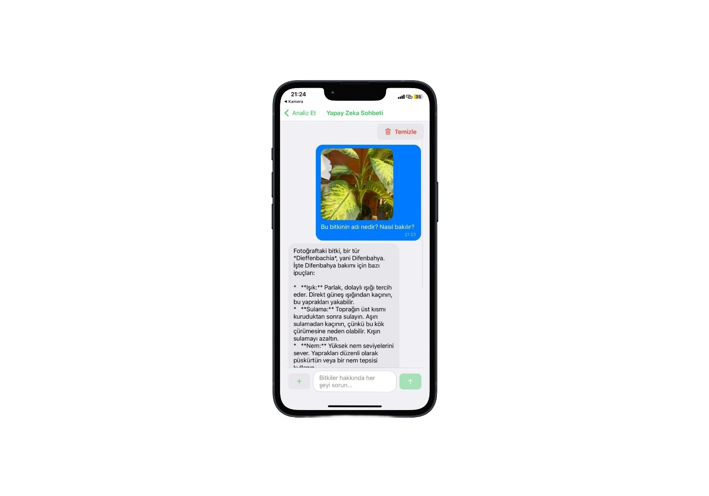
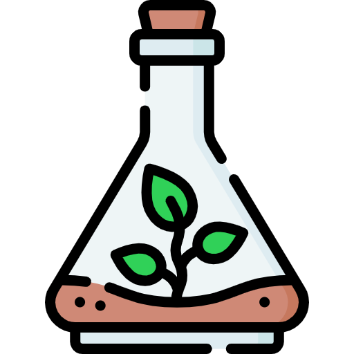
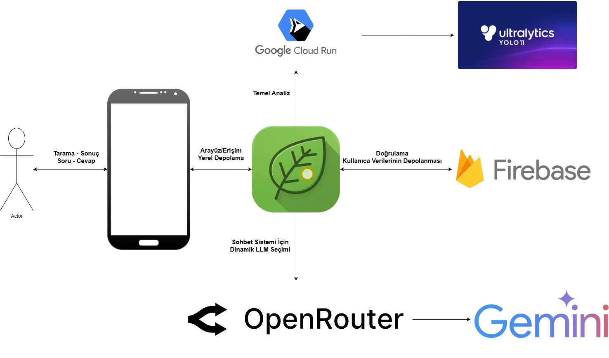
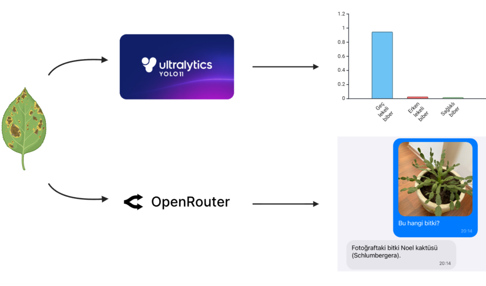

# Bitkim

<p align="center">
	
</p>

<p align="center">
	A mobile plant-care assistant for identifying leaf problems, chatting with AI, and tracking scan history.
</p>

<p align="center">
	
	
	
	
</p>

## Showcase

<table>
	<tr>
		<td align="center" width="50%">
			
		</td>
        <td align="center" width="50%">
            
	</tr>
	<tr>
		<td align="center" width="50%">
			
		</td>
		<td align="center" width="50%">
			
		</td>
	</tr>
</table>

## What Bitkim Does

Bitkim helps users capture a leaf, analyze it, and move straight into treatment guidance. The app combines a guided home experience, AI chat, a classic analyzer, account management, and cloud-backed history so the whole plant-care flow stays in one place.

## Visual Flow

<table>
	<tr>
		<td align="center" width="25%">
			
			<br />
			<strong>1. Capture the leaf</strong>
		</td>
		<td align="center" width="25%">
			
			<br />
			<strong>2. Scan the image</strong>
		</td>
		<td align="center" width="25%">
			
			<br />
			<strong>3. Get the result</strong>
		</td>
		<td align="center" width="25%">
			
			<br />
			<strong>4. Treat it</strong>
		</td>
	</tr>
</table>

## Key Features

- Photo-based plant analysis from camera or gallery.
- Two analysis paths: AI chat and a classic disease analyzer.
- Care tips and common disease guidance on the home screen.
- Account, profile, language, password, and email management in Settings.
- Scan history stored in the cloud for later review.
- Turkish and English localization.

## Tech Stack

- Expo + Expo Router
- React Native
- Firebase Authentication and Firestore
- Zustand for local state
- OpenAI-powered chat and analysis services
- i18n-based multilingual UI

## Getting Started

```bash
npm install
npm run start
```

### Platform Commands

```bash
npm run android
npm run ios
npm run web
```

## Project Structure

- `app/` - app routes, layouts, and screens
- `components/` - reusable UI pieces
- `services/` - API and data helpers
- `context/` - authentication and storage context
- `zustand/` - local application state
- `locales/` - translation files

## Notes

- Firebase configuration lives in `firebaseConfig.js`.
- Camera and gallery access are required for the analysis flow.

## Tech Stack

- Expo + Expo Router
- React Native
- Firebase Authentication and Firestore
- Zustand for local state
- Openrouter for AI chat and analysis
- i18n-based multilingual UI

<table>
	<tr>
		<td align="center" width="50%">
			
		</td>
		<td align="center" width="50%">
			
		</td>
	</tr>
</table>

## License

This project is licensed under the MIT License.

---

# Bitkim (Türkçe)

<p align="center">
	
</p>

<p align="center">
	Yaprak problemlerini tanımlamak, yapay zeka ile sohbet etmek ve tarama geçmişini takip etmek için bir mobil bitki bakım asistanı.
</p>

<p align="center">
	
	
	
	
</p>

## Görünüm

<table>
	<tr>
		<td align="center" width="50%">
			
		</td>
        <td align="center" width="50%">
            
	</tr>
	<tr>
		<td align="center" width="50%">
			
		</td>
		<td align="center" width="50%">
			
		</td>
	</tr>
</table>

## Bitkim Ne Yapar?

Bitkim, kullanıcıların bir yaprağın fotoğrafını çekmesine, onu analiz etmesine ve doğrudan tedavi rehberliğine geçmesine yardımcı olur. Uygulama; rehberli bir ana sayfa deneyimi, yapay zeka sohbeti, klasik bir analizör, hesap yönetimi ve tüm bitki bakım akışının tek bir yerde kalmasını sağlayan bulut tabanlı geçmişi birleştirir.

## Görsel Akış

<table>
	<tr>
		<td align="center" width="25%">
			
			<br />
			<strong>1. Yaprağı çek</strong>
		</td>
		<td align="center" width="25%">
			
			<br />
			<strong>2. Görüntüyü tara</strong>
		</td>
		<td align="center" width="25%">
			
			<br />
			<strong>3. Sonucu al</strong>
		</td>
		<td align="center" width="25%">
			
			<br />
			<strong>4. Tedavi et</strong>
		</td>
	</tr>
</table>

## Temel Özellikler

- Kamera veya galeriden fotoğraf tabanlı bitki analizi.
- İki analiz yolu: Yapay Zeka sohbeti ve klasik bir hastalık analizörü.
- Ana ekranda bakım ipuçları ve yaygın hastalık rehberliği.
- Ayarlarda hesap, profil, dil, şifre ve e-posta yönetimi.
- Daha sonra incelenmek üzere bulutta saklanan tarama geçmişi.
- Türkçe ve İngilizce dil desteği.

## Teknoloji Yığını

- Expo + Expo Router
- React Native
- Firebase Authentication ve Firestore
- Yerel durum için Zustand
- Openrouter destekli sohbet ve analiz servisleri
- i18n tabanlı çok dilli kullanıcı arayüzü

## Başlangıç

```bash
npm install
npm run start
```

### Platform Komutları

```bash
npm run android
npm run ios
npm run web
```

## Proje Yapısı

- `app/` - uygulama rotaları, düzenleri ve ekranları
- `components/` - yeniden kullanılabilir kullanıcı arayüzü parçaları
- `services/` - API ve veri yardımcıları
- `context/` - kimlik doğrulama ve depolama bağlamı
- `zustand/` - yerel uygulama durumu
- `locales/` - çeviri dosyaları

## Notlar

- Firebase yapılandırması `firebaseConfig.js` dosyasında bulunur.
- Analiz akışı için kamera ve galeri erişimi gereklidir.

## Lisans

Bu proje MIT Lisansı ile lisanslanmıştır.
